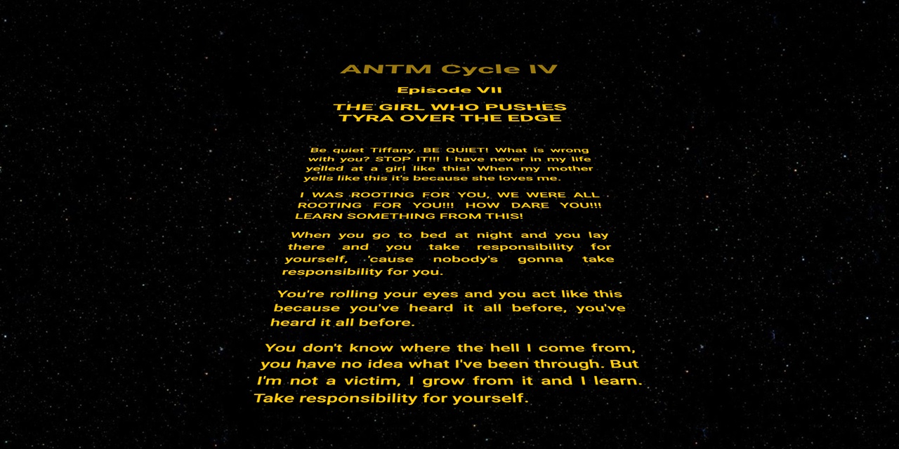

<p id="header"><p>

<table><tr>
<td> <a href="https://github.com/emjose/heart-animation/#header"></a> </td>
<td> <a href="https://github.com/emjose/one-hundred/#header"></a> </td>
<td> <a href="https://github.com/emjose/form-validation/#header"></a> </td>
</tr></table>

<br>

<p id="project-title"><p>

<a href=#table-of-contents></a> 

<br>

<a href="https://emjose.github.io/opening-crawl/"></a>

#

<p id="table-of-contents"><p>

<a href=#table-of-contents></a>  

- [100 Days of Code](#100days)
- [Installation](#installation) 
- [Live Site](#live-site)
- [Resources](#resources)
- [Copyright](#copyright)
- [Let's Connect!](#lets-connect) 

#

<p id="100days"><p>

<a href=#100days></a>  

### Day 13: February 19, 2021
- I love <a href="https://www.starwars.com/">Star Wars</a> and <a href="http://www.vh1.com/shows/americas-next-top-model">America's Next Top Model</a> (ANTM), so I made a Star Wars-style opening crawl of Tyra Banks' iconic <a href="https://youtu.be/C6OhhUDQJU4?t=282">"We were all rooting for you" speech</a>. 
  
- I attempted to add the <a href="https://youtu.be/CaWHI2_cDHI">ANTM winner's song</a> to the opening crawl, but the audio only worked on the first play, and not on subsequent reloads.

#

<p id="installation"><p>

<a href=#installation></a>

#### Git clone and cd into the repo folder:
``` 
git clone git@github.com:emjose/opening-crawl.git && cd opening-crawl 
```
#### Run the command:
```
open index.html
```

#

<p id="live-site"><p>

<a href="https://emjose.github.io/opening-crawl/"></a>  

<a href="https://emjose.github.io/opening-crawl/"></a>

#

<p id="resources"><p>

<a href=#resources></a>  

- #### [All Nine Star Wars Opening Crawls](https://youtu.be/kG58selILLs)

- #### [Star Wars Scrolling Text Tutorial](https://youtu.be/kHrV2ZHzF-0) by [The Net Ninja](https://www.youtube.com/channel/UCW5YeuERMmlnqo4oq8vwUpg)

- #### [America's Next Top Model Winner's Song "Free For All" by Nick Nolan](https://youtu.be/CaWHI2_cDHI)

- #### ["The Girl Who Pushes Tyra Over the Edge" Episode Synopsis from IMDb.com](https://www.imdb.com/title/tt0511485/)

- #### [Clip from America's Next Top Model, Season 4, Episode 7: The Girl Who Pushes Tyra Over the Edge](https://youtu.be/C6OhhUDQJU4)

- #### [My blog on how I created my Github READMEs](https://emmanueljose.medium.com/readme-a-makeover-story-b9c7be37a6de?sk=7ae6623d365409d875753e4604e42ffd) 

#

<p id="copyright"><p>

<a href=#copyright></a>

- This project is for made for educational purposes only. 

- <a href="https://www.starwars.com/">Star Wars</a> is trademarked by <a href="https://www.lucasfilm.com/">Lucasfilm Ltd.</a>. TM & © Lucasfilm Ltd. All Rights Reserved.
  
- <a href="http://www.vh1.com/shows/americas-next-top-model">America's Next Top Model</a> is copyright of <a href="https://www.viacomcbs.com/">ViacomCBS</a>. © ViacomCBS Inc. All Rights Reserved.

#

<p id="lets-connect"><p>

<a href=#lets-connect></a>

<p><a href="https://twitter.com/Emmanuel_Labor"> <a href="https://www.linkedin.com/in/emmanuelpjose/"> <a href="https://emmanueljose.medium.com/"> <a href="https://www.instagram.com/emmanuel_jose/"> <a href="mailto:emjose@gmail.com"> <a href="https://www.emmanuel-jose.com/"> <a href="https://github.com/emjose"></p>

#

<a href=#header></a>